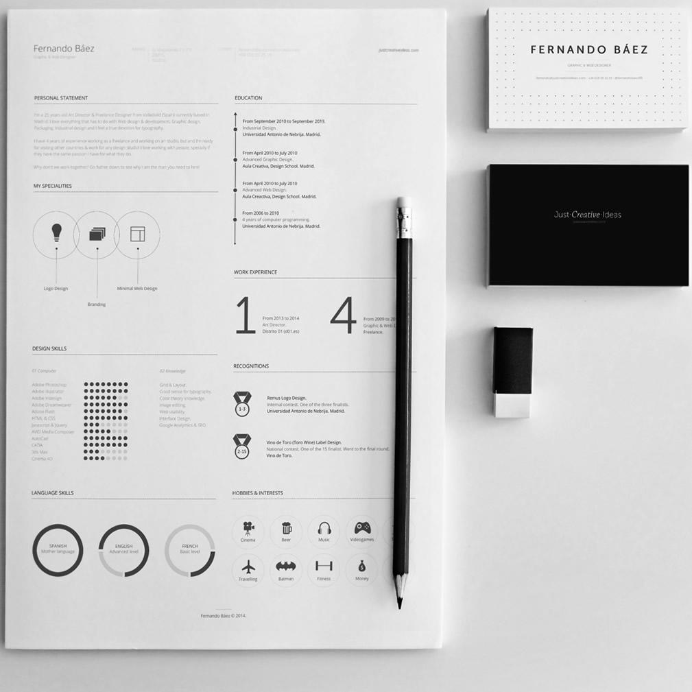

# Resume 简历主题

这是一个程序员简历主题，由 [Zresume](https://github.com/izuolan/zresume)项目重写。



## 特色

* 轻量，无需数据库。
* 直接使用 Markdown 和 Yaml 编写简历，实时解析页面，支持热重载。
* 支持 Docker 一键部署。

## 使用方法

### 手动部署

```sh
# 安装依赖
npm install

# 预览
npm run dev

# 构建
npm run build
```
### Docker 部署

> 安装及配置 Docker 将不在此处说明，请自行解决